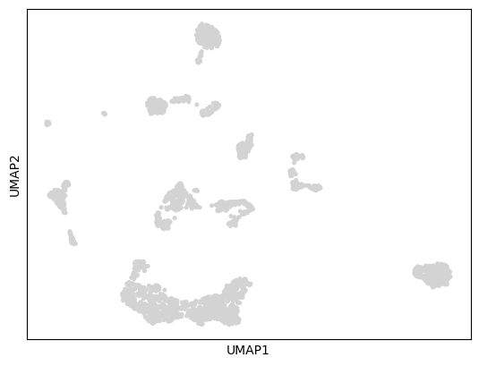
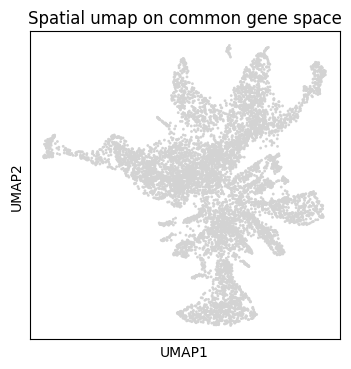
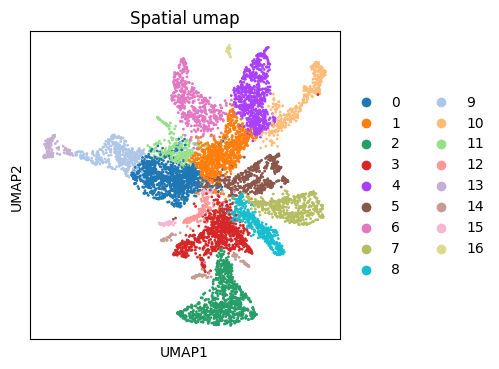

Tutorial 0: Data Preparation
============================

This tutorial guides through data preparation for tutorial 1. For the input data and the 
jupyter notebook file please use the following `link
<https://github.com/ankitbioinfo/nico_tutorial/blob/main/Start_Data_prep.ipynb>`_

.. code:: ipython3

    import scanpy as sc
    import matplotlib.pyplot as plt
    import numpy as np
    import pandas as pd
    import os
    #import pickle
    #from scipy.spatial import cKDTree
    #from SCTransform import SCTransform

    # if you installed the nico package
    import nico 
    from nico import Annotations as sann
    
    # if you did not install the nico package and downloaded the nico files into the current directory
    # import Annotations as sann

    import warnings
    import time
    warnings.filterwarnings('ignore')
    #export PYTHONWARNINGS='ignore:Multiprocessing-backed parallel loops:UserWarning'
    os.environ["PYTHONWARNINGS"] = "ignore::UserWarning"

Usage introduction
~~~~~~~~~~~~~~~~~~

Please download the sample data from the git repository `nico_tutorial
<https://github.com/ankitbioinfo/nico_tutorial/>`_
and keep all the files and folders in the same directory to complete the
tutorial. Unzip inputRef.zip and inputQuery.zip.

inputRef (single-cell RNA-sequencing data) 

inputQuery (single-cell resolution spatial transcriptomics data) 

NiCoLRdb.txt (Ligand-receptor database file)

The following notebook normalizes the count data and computes the
initial Leiden clustering for the spatial transcriptomics data to perform
the cell type annotation using NiCo:
Start_Data_prep.ipynb

Once all the steps of the data preparation notebook are finalized, run
the core notebook to perform the full NiCo analysis:
nico_analysis_highres_image_tech.ipynb

.. code:: ipython3

    # These are the input data paths for the scRNA-seq and spatial data
    # If the data is not in h5ad or csv format then please adjust following the standard scanpy routine.

    scdatapath='./inputRef/'
    spdatapath='./inputQuery/'

    ad_spatial_ori=sc.read(spdatapath+'gene_by_cell.csv').transpose()
    ad_seq_ori=sc.read_h5ad(scdatapath+'input_ref.h5ad')

    # This is the coordinate file of the cell centroids from the spatial transcriptomics experiment.
    coordinate = pd.read_csv(spdatapath+'tissue_positions_list.csv')
    coordinate=coordinate.to_numpy()

.. code:: ipython3

    # make sure that the order of cells in the count matrix and in the cell location
    # matrix are identical (command should return TRUE); otherwise correct the order

    np.array_equal(coordinate[:,0],ad_spatial_ori.obs_names)

.. parsed-literal::

    True

.. code:: ipython3

    ad_spatial_ori.obsm['spatial']=coordinate[:,1:].astype(float)

If a spatial h5ad object is already available:
~~~~~~~~~~~~~~~~~~~~~~~~~~~~~~~~~~~~~~~~~~~~~~

If spatial data in h5ad format with coordinate information tagged as spatial (.obsm[‘spatial’])
is already available, the previous commands can be skipped and the spatial data directly loaded:

ad_spatial_ori=sc.read_h5ad(spdatapath+‘input_query_spatial_data.h5ad’)

.. code:: ipython3

    # data size of the variables
    print(ad_spatial_ori)
    print(ad_seq_ori)
    print(coordinate.shape)

.. parsed-literal::

    AnnData object with n_obs × n_vars = 7416 × 241
        obsm: 'spatial'
    AnnData object with n_obs × n_vars = 2239 × 32287
        obs: 'cluster'
    (7416, 4)

.. code:: ipython3

    # Filter the cells and genes
    sc.pp.filter_cells(ad_spatial_ori, min_counts=5)
    sc.pp.filter_cells(ad_seq_ori, min_counts=5)

    sc.pp.filter_genes(ad_spatial_ori, min_cells=1)
    sc.pp.filter_genes(ad_seq_ori, min_cells=1)

    print(ad_spatial_ori)
    print(ad_seq_ori)

.. parsed-literal::

    AnnData object with n_obs × n_vars = 7416 × 241
        obs: 'n_counts'
        var: 'n_cells'
        obsm: 'spatial'
    AnnData object with n_obs × n_vars = 2239 × 21197
        obs: 'cluster', 'n_counts'
        var: 'n_cells'

Reference scRNA-seq data
~~~~~~~~~~~~~~~~~~~~~~~~

Copy the scRNA-seq data into a new variable as well as into the raw layer.
The Original_count count matrix will be used to derive the UMAP for the
scRNA-seq data. The raw layer count matrix will be used to find the
Spearman and Cosine similarity of genes with the latent factors.

.. code:: ipython3

    Original_counts=ad_seq_ori.copy()
    Original_counts.raw=Original_counts.copy()

.. code:: ipython3

    # Standard scanpy analysis

    sc.pp.normalize_total(Original_counts)
    sc.pp.log1p(Original_counts)

    sc.tl.pca(Original_counts)
    sc.pp.neighbors(Original_counts)
    sc.tl.umap(Original_counts)
    sc.pl.umap(Original_counts)

.. parsed-literal::

    OMP: Info #276: omp_set_nested routine deprecated, please use omp_set_max_active_levels instead.

.. code:: ipython3

    # save the data
    Original_counts.write_h5ad(scdatapath+'Original_counts.h5ad')

Find shared genes between scRNA-seq and spatial data
~~~~~~~~~~~~~~~~~~~~~~~~~~~~~~~~~~~~~~~~~~~~~~~~~~~~

Now find the shared genes between two modalities and subset the matrix
to retain only common genes.

.. code:: ipython3

    sp_genename=ad_spatial_ori.var_names.to_numpy()
    sc_genename=ad_seq_ori.var_names.to_numpy()

    index_sp,index_sc=sann.find_index(sp_genename,sc_genename)
    #ad_seq_common=ad_seq_ori[:,index_sc].copy()
    ad_seq_common=ad_seq_ori.copy()
    ad_spatial_common=ad_spatial_ori[:,index_sp].copy()

    print(len(sp_genename[index_sp]))
    print(len(sc_genename[index_sc]))

.. parsed-literal::

    203
    203

Perform scTransform-normalization (Pearson residuals) with two different alternative stratgies
~~~~~~~~~~~~~~~~~~~~~~~~~~~~~~~~~~~~~~~~~~~~~~~~~~~~~~~~~~~~~~~~~~~~~~~~~~~~~~~~~~~~~~~~~~~~~~

.. code:: ipython3

    # Alternative 1
    # The sctransform normalization function from scanpy

    '''
    ad_seq_common.raw=ad_seq_common.copy()
    ad_spatial_common.raw=ad_spatial_common.copy()
    # perform scTranform normalization common gene space for spatial data and scRNAseq data
    sc.experimental.pp.normalize_pearson_residuals(ad_seq_common,inplace=True) #ad_seq_common.X[ad_seq_common.X<0]=0

    ad_seq_common.write_h5ad(scdatapath+'sct_singleCell.h5ad')
    sc.experimental.pp.normalize_pearson_residuals(ad_spatial_common,inplace=True) #ad_spatial_common.X[ad_spatial_common.X<0]=0
    #print(ad_spatial_common.X.toarray()
    '''

.. parsed-literal::

    "\nad_seq_common.raw=ad_seq_common.copy()\nad_spatial_common.raw=ad_spatial_common.copy()\n# perform scTranform normalization common gene space for spatial data and scRNAseq data  \nsc.experimental.pp.normalize_pearson_residuals(ad_seq_common,inplace=True) #ad_seq_common.X[ad_seq_common.X<0]=0\n\nad_seq_common.write_h5ad(scdatapath+'sct_singleCell.h5ad')\nsc.experimental.pp.normalize_pearson_residuals(ad_spatial_common,inplace=True) #ad_spatial_common.X[ad_spatial_common.X<0]=0\n#print(ad_spatial_common.X.toarray()\n"

.. code:: ipython3

    # Alternative 2
    # The normalization using an external functions
    # In the manuscript, this functions was used

    temp_spatial=ad_spatial_common.copy()
    temp_seq=ad_seq_common.copy()

    sct_ad_sp = sann.SCTransform(ad_spatial_common,min_cells=1,gmean_eps=1,n_genes=500,n_cells=None, #use all cells
                            bin_size=500,bw_adjust=3,inplace=False)

    sct_ad_sc = sann.SCTransform(ad_seq_common,min_cells=1,gmean_eps=1,n_genes=500,n_cells=None, #use all cells
    		                bin_size=500,bw_adjust=3,inplace=False)

    ad_spatial_common=sct_ad_sp.copy()
    ad_seq_common=sct_ad_sc.copy()

    ad_spatial_common.raw=temp_spatial.copy()
    ad_seq_common.raw=temp_seq.copy()
    ad_spatial_common.obsm['spatial']= temp_spatial.obsm['spatial']

    ad_seq_common.write_h5ad(scdatapath+'sct_singleCell.h5ad')

Perform Leiden clustering on spatial transcriptomics data to guide cell type annotation
---------------------------------------------------------------------------------------

.. code:: ipython3

    # standard scanpy analysis
    sc.pp.pca(ad_spatial_common)
    sc.pp.neighbors(ad_spatial_common,n_pcs=30)
    sc.tl.umap(ad_spatial_common)

.. code:: ipython3

    # visualize umap
    plt.rcParams["figure.figsize"] = (4, 4)
    sc.pl.umap(ad_spatial_common, title=["Spatial umap on common gene space"],wspace=0.4,show=True)

Guiding Leiden cluster resolutions
~~~~~~~~~~~~~~~~~~~~~~~~~~~~~~~~~~

Peform Leiden clustering for several resolution parameters. If it takes
a long time to compute, then you can limit the number of parameters.

Any of the resolution parameters here can be used as an input parameter
(guiding_spatial_cluster_resolution_tag) in the NiCo pipeline

.. code:: ipython3

    #sc.tl.leiden(ad_spatial_common, resolution=0.3,key_added="leiden0.3")
    sc.tl.leiden(ad_spatial_common, resolution=0.4,key_added="leiden0.4")
    sc.tl.leiden(ad_spatial_common, resolution=0.5,key_added="leiden0.5")
    #sc.tl.leiden(sct_ad_sp, resolution=0.6,key_added="leiden0.6")
    #sc.tl.leiden(sct_ad_sp, resolution=0.7,key_added="leiden0.7")
    #sc.tl.leiden(sct_ad_sp, resolution=0.8,key_added="leiden0.8")

.. code:: ipython3

    # Visualize your initial spatial clustering in the umap
    # A good resolution parameter should yield clusters corresponding to major cell types.

    sc.pl.umap(ad_spatial_common, color=["leiden0.5"], title=["Spatial umap"],wspace=0.4,
               show=True, save='_spatial_umap.png')

.. parsed-literal::

    WARNING: saving figure to file figures/umap_spatial_umap.png

.. code:: ipython3

    # Save the Leiden clusters for all resolution parameters as well as normalized count data in h5ad format.
    ad_spatial_common.write_h5ad(spdatapath+'sct_spatial.h5ad')
