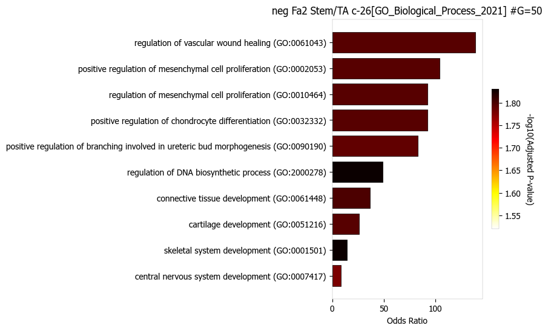

Tutorial 1: seqFISH, Xenium, or MERSCOPE
=========================================

This tutorial analyze the single cell resolution imaging based spatial transcriptomics data such as seqFISH, Xenium, and MERSCOPE.
Please prepare the input files of scRNA-seq count data and spatial transcriptomics data mentioned `here.
<https://github.com/ankitbioinfo/nico_tutorial>`_

.. code:: ipython3

    # if you installed the nico package then uncomment and load the respective modules

    #from nico import Annotations as sann
    #from nico import Interactions as sint
    #from nico import Covariations as scov

    import Annotations as sann
    import Interactions as sint
    import Covariations as scov

    #import scanpy as sc
    #import gseapy
    #import xlsxwriter

    #import numpy as np
    #import time
    #import os

    import matplotlib as plt

.. code:: ipython3

    plt.rcParams['pdf.fonttype'] = 42
    plt.rcParams['ps.fonttype'] = 42
    plt.rcParams['axes.linewidth'] = 0.1 #set the value globally

    # please use Helvetica font according to your OS to make compatible with Adobe Illustrator.
    plt.rcParams['font.family'] = 'Helvetica'
    plt.rcParams['font.sans-serif'] = ['Helvetica']

    # Use the default font for all the figures
    plt.rcParams['font.family'] = 'sans-serif'
    plt.rcParams['font.sans-serif'] = ['Tahoma', 'DejaVu Sans','Lucida Grande', 'Verdana']

    import warnings
    warnings.filterwarnings("ignore")

**Usage introduction**

For details of the function usage and input parameters either refer to
the documentation or just write the function and add .__doc_\_ to
retrieve infromation on all relelvant parameters.

print(sann.find_anchor_cells_between_ref_and_query.__doc__)
print(sint.spatial_neighborhood_analysis.__doc__)
print(scov.gene_covariation_analysis.__doc__)

All the figures will be saved in ``saveas=pdf`` format as vector
graphics by default. For every function that generates figures, the
following default parameters are used: transparent_mode=False,
saveas=‘pdf’,showit=True, dpi=300

For saving figures in png format, set saveas=‘png’ For generating images
without background, set transparent_mode=True If figure outputs within
the Jupyter Notebook is not desired, set showit=False

Please download the sample data from the git repository
https://github.com/ankitbioinfo/nico_tutorial and keep all the files and
folders in the same directory to complete the tutorial.

inputRef (single-cell RNA-sequencing data) inputQuery (single-cell
resolution spatial transcriptomics data) NiCoLRdb.txt (Ligand-receptor
database file)

Before running the Perform_spatial_analysis.ipynb notebook, input data
need to be prepared by running the
Start_Data_preparation_for_niche_analysis.ipynb notebook Once all the
steps of Start_Data_preparation_for_niche_analysis.ipynb are completed,
the following commands can be executed to run a complete NiCo aanlysis.

.. code:: ipython3

    #parameters for saving plots
    saveas='png'
    transparent_mode=False

.. code:: ipython3

    ref_datapath='./inputRef/'
    query_datapath='./inputQuery/'

    output_nico_dir='./nico_out/'
    output_annotation_dir=None #uses default location
    #output_annotation_dir=output_nico_dir+'annotations/'
    annotation_save_fname= 'nico_celltype_annotation.h5ad'
    inputRadius=0

The cell type cluster slot in scRNAseq data is ``ref_cluster_tag`` For
example in AnnData object the location of slot: adata.obs[‘cluster’] In
this slot cell type annotation of scRNAseq data is stored

.. code:: ipython3

    ref_cluster_tag='cluster' #scRNAseq cell type slot
    annotation_slot='nico_ct' #spatial cell type slot

A: Perform cell type annotation of spatial data
--------------------------------------------------

First find anchored cells between two modalities

.. code:: ipython3

    anchors_and_neighbors_info=sann.find_anchor_cells_between_ref_and_query(
    refpath=ref_datapath,
    quepath=query_datapath,
    output_nico_dir=output_nico_dir,
    output_annotation_dir=output_annotation_dir)

Selection of parameters
~~~~~~~~~~~~~~~~~~~~~~~

Perform NiCo cell type annotation using the spatial Leiden cluster from
the Start_Data_preparation_for_niche_analysis.ipynb notebook, e.g., with
Leiden resolution parameter 0.4

If you have a large number of cells (>200,000) and want to perform cell
type annotation with different Leiden resolution parameters or any other
parameters, save the output_annotation_dir directory with a different
name for each run.

MNN (Mutual Nearest Neighbors) alignment takes a considerable amount of
time, which can delay the analysis in ordinary laptop. Therefore, it is
advisable to save the anchors_data_50.npz file, as the anchor
information is independent of the resolution parameter.

The annotation slot in scRNAseq data and initial cluster slot in spatial data
~~~~~~~~~~~~~~~~~~~~~~~~~~~~~~~~~~~~~~~~~~~~~~~~~~~~~~~~~~~~~~~~~~~~~~~~~~~~~

ref_cluster_tag=‘cluster’ #### ref_cluster_tag define the cellType slot
for scRNAseq data. Example .obs[‘cluster’] #### If scRNAseq cellType is
stored with some other slot then please change the slot name

guiding_spatial_cluster_resolution_tag=‘leiden0.4’
guiding_spatial_cluster_resolution_tag define the Leiden clustering slot
for spatial data. Example .obs[‘leiden0.4’]

.. code:: ipython3

    output_info=sann.nico_based_annotation(anchors_and_neighbors_info,
    guiding_spatial_cluster_resolution_tag='leiden0.4',
    across_spatial_clusters_dispersion_cutoff=0.15,
    resolved_tie_issue_with_weighted_nearest_neighbor='No')

This function ``sann.delete_files`` deletes the anchored file details
created in the ``find_anchor_cells_between_ref_and_query`` step. If you
have a large number of cells and want to experiment different annotation
parameters, do not delete this file as it can save a significant amount
of time.

.. code:: ipython3

    sann.delete_files(output_info)

.. code:: ipython3

    # Visualize the anchor cells between two modalities.
    # sann.visualize_spatial_anchored_cell_mapped_to_scRNAseq(output_info)

Save the annotation file into AnnData object
~~~~~~~~~~~~~~~~~~~~~~~~~~~~~~~~~~~~~~~~~~~~

Save the annotation file into AnnData object (annotation_save_fname)
along with given expression matrix in “output_nico_dir” directory.

.. code:: ipython3

    sann.save_annotations_in_spatial_object(output_info,
    anndata_object_name=annotation_save_fname)

.. parsed-literal::

    Nico based cluster annotations are saved in .obs['nico_ct'] slot

B: Annotations from different computational methods such cell2location or TACCO
--------------------------------------------------------------------------------

If user have an AnnData object with cell type annotations from different
methods, you can skip the previous steps.

To use your own annotations, provide the following files:
annotation_save_fname= ‘nico_celltype_annotation.h5ad’

The content of the AnnData object is as follows. The necessary slots are 'nico_ct', 'spatial', 'X_umap', and 'adata.raw.X', which contains the raw count data to finish the whole tutorial.

.. code-block:: console

   >>> adata
       AnnData object with n_obs × n_vars = 7416 × 203
           obs: 'umi_sct', 'log_umi_sct', 'gene_sct', 'log_gene_sct', 'umi_per_gene_sct', 'log_umi_per_gene_sct', 'leiden0.4', 'leiden0.5', 'nico_ct'
           var: 'Intercept_sct', 'log_umi_sct', 'theta_sct', 'Intercept_step1_sct', 'log_umi_step1_sct', 'dispersion_step1_sct', 'genes_step1_sct', 'log10_gmean_sct'
           uns: 'leiden', 'leiden0.5_colors', 'neighbors', 'pca', 'umap'
           obsm: 'X_pca', 'X_umap', 'spatial'
           varm: 'PCs'
           obsp: 'connectivities', 'distances'
   >>> adata.raw.X
       array([[ 0.,  0.,  0., ...,  0.,  0.,  9.],
              [ 0., 39.,  0., ...,  0.,  0.,  5.],
              [ 0., 49.,  0., ...,  0.,  0.,  4.],
              ...,
              [ 0.,  0.,  0., ...,  1.,  0.,  0.],
              [ 0.,  0.,  0., ...,  0.,  0.,  0.],
              [ 0.,  0.,  0., ...,  0.,  0.,  0.]], dtype=float32)
   >>> adata.X.toarray()
       array([[ 0.        ,  0.        ,  0.        , ...,  0.        ,
                   0.        ,  5.1008253 ],
              [ 0.        ,  8.992419  ,  0.        , ...,  0.        ,
                   0.        ,  1.5530139 ],
              [ 0.        , 11.429277  ,  0.        , ...,  0.        ,
                   0.        ,  1.1400297 ],
                 ...,
              [ 0.        ,  0.        ,  0.        , ...,  0.47980395,
                   0.        ,  0.        ],
              [ 0.        ,  0.        ,  0.        , ...,  0.        ,
                   0.        ,  0.        ],
              [ 0.        ,  0.        ,  0.        , ...,  0.        ,
                   0.        ,  0.        ]], dtype=float32)

Replace the annotation_save_fname AnnData object with your own AnnData
object containing the annotations. Ensure that the annotation slot name
in your AnnData object is adjusted to match the following:

annotation_slot=‘nico_ct’

This will ensure compatibility with the NiCo pipeline.

Visualize the spatial annotations of all cell types
~~~~~~~~~~~~~~~~~~~~~~~~~~~~~~~~~~~~~~~~~~~~~~~~~~~

Left side: tissue map, Right side: UMAP

.. code:: ipython3

    sann.visualize_umap_and_cell_coordinates_with_all_celltypes(
    output_nico_dir=output_nico_dir,
    output_annotation_dir=output_annotation_dir,
    anndata_object_name=annotation_save_fname,
    #spatial_cluster_tag='nico_ct',
    spatial_cluster_tag=annotation_slot,
    spatial_coordinate_tag='spatial',
    umap_tag='X_umap',
    saveas=saveas,transparent_mode=transparent_mode)

.. parsed-literal::

    The figures are saved:  ./nico_out/annotations/tissue_and_umap_with_all_celltype_annotations.png

Visualize spatial annotations of selected pairs (or larger sets) of cell types
~~~~~~~~~~~~~~~~~~~~~~~~~~~~~~~~~~~~~~~~~~~~~~~~~~~~~~~~~~~~~~~~~~~~~~~~~~~~~~

Left side: tissue map, Right side: UMAP

.. code:: ipython3

    choose_celltypes=[['Stem/TA','Paneth'],['Paneth','Goblet']]

    sann.visualize_umap_and_cell_coordinates_with_selected_celltypes(
    choose_celltypes=choose_celltypes,
    output_nico_dir=output_nico_dir,
    output_annotation_dir=output_annotation_dir,
    anndata_object_name=annotation_save_fname,
    spatial_cluster_tag=annotation_slot,spatial_coordinate_tag='spatial',umap_tag='X_umap',
    saveas=saveas,transparent_mode=transparent_mode)

.. parsed-literal::

    The figures are saved:  ./nico_out/annotations/fig_individual_annotation/Stem_TA0.png
    The figures are saved:  ./nico_out/annotations/fig_individual_annotation/Paneth1.png

.. code:: ipython3

    # For visualizing every cell type individually, leave list choose_celltypes list empty.
    #sann.visualize_umap_and_cell_coordinates_with_selected_celltypes(choose_celltypes=[])

C: Infer significant niche cell type interactions
-------------------------------------------------

**Radius definition**

The radius R=0 in NiCo incorporates the neighboring cells that are in
immediate contact with the central cell to construct the expected
neighborhood composition matrix. We envision NiCo as a method to explore
direct interactions with physical neighbors (R=0), but in principle
finite distance interactions mediated by diffusive factors could be
explored by increasing R and comparing to the interactions obtained with
R=0.

It may be helpful to explore a larger radius if it is expected that cell
types interact through long-range interactions. However, during the
covariation task immediate neighbors typically capture the strongest
signal, while a larger radius averages the signal from a more
significant number of cells, potentially diluting the signal. Therefore,
we recommend running NiCo with R=0.

Perform neighborhood analysis across direct neighbors (juxtacrine
signaling, R=0) of the central niche cell type.

To exclude cell types from the neighborhood analysis, add celltype names
to the list removed_CTs_before_finding_CT_CT_interactions.

In the example below, the cell types Basophils, Cycling/GC B cell, and
pDC, would not be included in the niche interaction task due to their
low abundance.

.. code:: ipython3

    do_not_use_following_CT_in_niche=['Basophils','Cycling/GC B cell','pDC']

    niche_pred_output=sint.spatial_neighborhood_analysis(
    Radius=inputRadius,
    output_nico_dir=output_nico_dir,
    anndata_object_name=annotation_save_fname,
    spatial_cluster_tag='nico_ct',
    removed_CTs_before_finding_CT_CT_interactions=do_not_use_following_CT_in_niche)

.. parsed-literal::

    average neighbors: 4.83637851104445
    average distance: 64.08306688807858
    data shape (7305, 19) (7305,) neighbor shape (7305, 17)
    Searching hyperparameters  Grid method: 0.015625
    Searching hyperparameters  Grid method: 0.0078125
    Searching hyperparameters  Grid method: 0.0078125
    Inverse of lambda regularization found 0.0078125
    training (5844, 17) testing (1461, 17) coeff (17, 17)

.. code:: ipython3

    # this cutoff is use for the visualization of cell type interactions network
    celltype_niche_interaction_cutoff=0.1

In some computing machine pygraphviz is not able to load the neato
package automatically. In such case please define the location of the
neato package. If you install pygraphviz through conda
``conda install -c conda-forge pygraphviz`` then most likely it should
work.

::

   import pygraphviz
   a=pygraphviz.AGraph()
   a._get_prog('neato')

   import os
   if  not '/home/[username]/miniforge3/envs/SC/bin/' in os.environ["PATH"]:
       os.environ["PATH"] += os.pathsep + '/home/[username]/miniforge3/envs/SC/bin/'

.. code:: ipython3

    # Plot the niche interaction network without any edge weight details for cutoff 0.1

    sint.plot_niche_interactions_without_edge_weight(niche_pred_output,
    niche_cutoff=celltype_niche_interaction_cutoff,
    saveas=saveas,transparent_mode=transparent_mode)

.. parsed-literal::

    The figures are saved:  ./nico_out/niche_prediction_linear/Niche_interactions_without_edge_weights_R0.png

.. image:: tutorial1_files/tutorial1_36_1.png

.. code:: ipython3

    # Plot the niche interaction network with edge weight details for cutoff 0.1

    sint.plot_niche_interactions_with_edge_weight(niche_pred_output,
    niche_cutoff=celltype_niche_interaction_cutoff,
    saveas=saveas,transparent_mode=transparent_mode)

.. parsed-literal::

    The figures are saved:  ./nico_out/niche_prediction_linear/Niche_interactions_with_edge_weights_R0.png

Cell type niche plot individually
~~~~~~~~~~~~~~~~~~~~~~~~~~~~~~~~~~

Order niche cell types by magnitude of regression coefficients, add
celltype names to the list argument choose_celltypes, e.g., for the
Stem/TA and Paneth cell niche.

.. code:: ipython3

    # Blue dotted line in following plot is celltype_niche_interaction_cutoff

    sint.find_interacting_cell_types(niche_pred_output,
    choose_celltypes=['Stem/TA','Paneth'],
    celltype_niche_interaction_cutoff=celltype_niche_interaction_cutoff,
    saveas=saveas,transparent_mode=transparent_mode,figsize=(4.0,2.0))

.. parsed-literal::

    The figures are saved:  ./nico_out/niche_prediction_linear/TopCoeff_R0/Rank1_Paneth.png
    The figures are saved:  ./nico_out/niche_prediction_linear/TopCoeff_R0/Rank3_Stem_TA.png

If niche cell types from the niche neighborhood of all central cell
types should be plotted or saved, then leave choose_celltypes list
argument empty.

.. code:: ipython3

    #sint.find_interacting_cell_types(niche_pred_output,choose_celltypes=[])

.. code:: ipython3

    # Plot the ROC curve of the classifier prediction for one of the crossfolds.
    # sint.plot_roc_results(niche_pred_output,saveas=saveas,transparent_mode=transparent_mode))
    # sint.plot_predicted_probabilities(niche_pred_output)

Plot the average confusion matrix of the classifier from cross-folds

.. code:: ipython3

    sint.plot_confusion_matrix(niche_pred_output,
    saveas=saveas,transparent_mode=transparent_mode)

.. parsed-literal::

    The figures are saved:  ./nico_out/niche_prediction_linear/Confusing_matrix_R0.png

Plot the average coefficient matrix of the classifier from cross-folds

.. code:: ipython3

    sint.plot_coefficient_matrix(niche_pred_output,
    saveas=saveas,transparent_mode=transparent_mode)

.. parsed-literal::

    The figures are saved:  ./nico_out/niche_prediction_linear/weight_matrix_R0.png

Plot the evaluation score of the classifier for different metrics

.. code:: ipython3

    sint.plot_evaluation_scores(niche_pred_output,
    saveas=saveas, transparent_mode=transparent_mode,
    figsize=(4,3))

.. parsed-literal::

    The figures are saved:  ./nico_out/niche_prediction_linear/scores_0.png

D: Perform niche cell state covariation analysis using latent factors
---------------------------------------------------------------------

Note: From module C onwards, Jupyter cells are independent of previous
steps. Therefore, if you want to try different settings, you do not need
to run the previous Jupyter cells.

Covariations parameters settings
~~~~~~~~~~~~~~~~~~~~~~~~~~~~~~~~

Infer desired number of latent factors (e.g., no_of_factors=3) for each
cell type from both modalities using integrated non-negative matrix
factorization. Set iNMFmode=False for applying the conventional
non-negative matrix factorization method. In this case, latent factors
will be derived from the scRNA-seq data and transfered to the spatial
modality.

This option is preferable if spatial data are affected by substantial
technical noise due to unspecific background signal or gene expression
spill-over between neighboring cell types due to imperfect segmentation.

Ligand-Receptor database file
~~~~~~~~~~~~~~~~~~~~~~~~~~~~~

NiCoLRdb.txt is the name of the ligand-receptor database file. Users can
use databases of similar format from any resource.

NiCoLRdb.txt was created by merging ligand-receptor pairs from NATMI,
OMNIPATH, and CellPhoneDB. User can download this database from github
and put into local directory from where this notebook is getting run.

.. code:: ipython3

    # By default, it run in spatial_integration_modality='double' that means
    # it integrates spatial transcriptomics with scRNAseq data modalities

    cov_out=scov.gene_covariation_analysis(iNMFmode=True,
            Radius=inputRadius,
            no_of_factors=3,
            refpath=ref_datapath,
            quepath=query_datapath,
            spatial_integration_modality='double',
            output_niche_prediction_dir=output_nico_dir,
            ref_cluster_tag=ref_cluster_tag) #LRdbFilename='NiCoLRdb.txt'

.. parsed-literal::

    common genes between sc and sp 203 203

     Spatial and scRNA-seq number of clusters, respectively  17 19
    Common cell types between spatial and scRNA-seq data   17 {'cDC/monocyte', 'neurons/enteroendocrine', 'Lymphatic', 'Plasma', 'Stroma', 'Tuft', 'Macrophage', 'Goblet', 'Glial', 'Blood vasc.', 'Paneth', 'MZE', 'T cell', 'TZE', 'Rest B', 'BZE', 'Stem/TA'}

    The spatial cluster name does not match the scRNA-seq cluster name  set()
    If the above answer is Null, then everything is okay. However, if any spatial cell type does not exist in the scRNA-seq data, please correct this manually; otherwise, NiCo will not run.

    BZE alpha, H size, W size, spH size: 30 (3, 325) (120, 3) (3, 1639)
    Blood vasc. alpha, H size, W size, spH size: 28 (3, 33) (58, 3) (3, 148)
    Glial alpha, H size, W size, spH size: 4 (3, 10) (44, 3) (3, 96)
    Lymphatic alpha, H size, W size, spH size: 24 (3, 267) (97, 3) (3, 1301)
    MZE alpha, H size, W size, spH size: 2 (3, 63) (60, 3) (3, 111)
    Macrophage alpha, H size, W size, spH size: 16 (3, 89) (113, 3) (3, 346)
    Paneth alpha, H size, W size, spH size: 12 (3, 128) (127, 3) (3, 184)
    Plasma alpha, H size, W size, spH size: 16 (3, 85) (101, 3) (3, 439)
    Rest B alpha, H size, W size, spH size: 12 (3, 234) (71, 3) (3, 48)
    Stem/TA alpha, H size, W size, spH size: 8 (3, 420) (140, 3) (3, 1131)
    Stroma alpha, H size, W size, spH size: 6 (3, 84) (107, 3) (3, 271)
    T cell alpha, H size, W size, spH size: 46 (3, 54) (86, 3) (3, 488)
    TZE alpha, H size, W size, spH size: 8 (3, 40) (72, 3) (3, 340)
    Tuft alpha, H size, W size, spH size: 40 (3, 90) (68, 3) (3, 25)
    cDC/monocyte alpha, H size, W size, spH size: 26 (3, 40) (86, 3) (3, 76)
    neurons/enteroendocrine alpha, H size, W size, spH size: 2 (3, 26) (103, 3) (3, 250)

Visualize the cosine similarity and Spearman correlation between genes and latent factors
~~~~~~~~~~~~~~~~~~~~~~~~~~~~~~~~~~~~~~~~~~~~~~~~~~~~~~~~~~~~~~~~~~~~~~~~~~~~~~~~~~~~~~~~~

Following function generates output for the top 30 genes based on cosine
similarity (left) or Spearman correlation (right)

Select cell types by adding IDs to list argument choose_celltypes, or
leave empty for generating output for all cell types

.. code:: ipython3

    scov.plot_cosine_and_spearman_correlation_to_factors(cov_out,
    choose_celltypes=['Paneth'],
    NOG_Fa=30,saveas=saveas,transparent_mode=transparent_mode,
    figsize=(15,10))

.. parsed-literal::

    cell types found  ['Paneth']
    The figures are saved:  ./nico_out/covariations_R0_F3/NMF_output/Paneth.png

.. image:: tutorial1_files/tutorial1_59_1.png

.. code:: ipython3

    #Cosine and spearman correlation: visualize the correlation of genes from NMF
    scov.plot_cosine_and_spearman_correlation_to_factors(cov_out,
    choose_celltypes=['Stem/TA'],
    NOG_Fa=30,saveas=saveas,transparent_mode=transparent_mode,
    figsize=(15,10))

.. parsed-literal::

    cell types found  ['Stem/TA']
    The figures are saved:  ./nico_out/covariations_R0_F3/NMF_output/Stem_TA.png

*Visualize genes in the latent factors along with average expression*

Call following function
(scov.extract_and_plot_top_genes_from_chosen_factor_in_celltype) to
visualize correlation and expression of genes associated with factors

For example, visualize and extract the top 10 genes (top_NOG=20)
correlating negatively (positively_correlated=False) by Spearman
correlation (correlation_with_spearman=True) for cell type Stem/TA
(choose_celltype=‘Stem/TA’) in factor 1 (choose_factor_id=1)

.. code:: ipython3

    dataFrame=scov.extract_and_plot_top_genes_from_chosen_factor_in_celltype(
    cov_out,
    choose_celltype='Stem/TA',
    choose_factor_id=1,
    top_NOG=20,
    correlation_with_spearman=True,
    positively_correlated=False,
    saveas=saveas,transparent_mode=transparent_mode )

.. parsed-literal::

    The figures are saved:  ./nico_out/covariations_R0_F3/dotplots/Factors_Stem_TA.png

Visualize the latent factor values and proportion of population expressed that gene
~~~~~~~~~~~~~~~~~~~~~~~~~~~~~~~~~~~~~~~~~~~~~~~~~~~~~~~~~~~~~~~~~~~~~~~~~~~~~~~~~~~

inspect the top genes in the given factor as in table
proportion_of_population_expressed: proportion of cells expressing a
gene in the respective cluster

.. code:: ipython3

    dataFrame

.. raw:: html

    

    
    <table border="1" class="dataframe">
      <thead>
        <tr style="text-align: right;">
          <th></th>
          <th>Gene</th>
          <th>Fa</th>
          <th>mean_expression</th>
          <th>proportion_of_population_expressed</th>
        </tr>
      </thead>
      <tbody>
        <tr>
          <th>0</th>
          <td>Chp2</td>
          <td>-0.626481</td>
          <td>1.619048</td>
          <td>0.388095</td>
        </tr>
        <tr>
          <th>1</th>
          <td>Rbp7</td>
          <td>-0.623792</td>
          <td>3.402381</td>
          <td>0.504762</td>
        </tr>
        <tr>
          <th>2</th>
          <td>Lgals3</td>
          <td>-0.584694</td>
          <td>2.847619</td>
          <td>0.480952</td>
        </tr>
        <tr>
          <th>3</th>
          <td>St3gal4</td>
          <td>-0.575894</td>
          <td>3.750000</td>
          <td>0.492857</td>
        </tr>
        <tr>
          <th>4</th>
          <td>Gm3336</td>
          <td>-0.563401</td>
          <td>1.152381</td>
          <td>0.383333</td>
        </tr>
        <tr>
          <th>5</th>
          <td>Coro2a</td>
          <td>-0.561060</td>
          <td>2.904762</td>
          <td>0.657143</td>
        </tr>
        <tr>
          <th>6</th>
          <td>Dhrs11</td>
          <td>-0.558811</td>
          <td>1.773810</td>
          <td>0.585714</td>
        </tr>
        <tr>
          <th>7</th>
          <td>Akr1c19</td>
          <td>-0.556204</td>
          <td>1.142857</td>
          <td>0.359524</td>
        </tr>
        <tr>
          <th>8</th>
          <td>Cdkn2b</td>
          <td>-0.555436</td>
          <td>0.973810</td>
          <td>0.257143</td>
        </tr>
        <tr>
          <th>9</th>
          <td>Serpinb6a</td>
          <td>-0.550037</td>
          <td>7.459524</td>
          <td>0.895238</td>
        </tr>
        <tr>
          <th>10</th>
          <td>Slc51a</td>
          <td>-0.549629</td>
          <td>1.123810</td>
          <td>0.333333</td>
        </tr>
        <tr>
          <th>11</th>
          <td>Anxa2</td>
          <td>-0.545655</td>
          <td>5.378572</td>
          <td>0.761905</td>
        </tr>
        <tr>
          <th>12</th>
          <td>Smim24</td>
          <td>-0.544530</td>
          <td>11.040476</td>
          <td>0.945238</td>
        </tr>
        <tr>
          <th>13</th>
          <td>Apol10a</td>
          <td>-0.541590</td>
          <td>1.271429</td>
          <td>0.297619</td>
        </tr>
        <tr>
          <th>14</th>
          <td>Cyp4f40</td>
          <td>-0.535966</td>
          <td>0.733333</td>
          <td>0.326190</td>
        </tr>
        <tr>
          <th>15</th>
          <td>Car4</td>
          <td>-0.535653</td>
          <td>2.238095</td>
          <td>0.464286</td>
        </tr>
        <tr>
          <th>16</th>
          <td>Mall</td>
          <td>-0.524968</td>
          <td>0.778571</td>
          <td>0.361905</td>
        </tr>
        <tr>
          <th>17</th>
          <td>Anxa13</td>
          <td>-0.524648</td>
          <td>2.526191</td>
          <td>0.621429</td>
        </tr>
        <tr>
          <th>18</th>
          <td>Pfkp</td>
          <td>-0.520550</td>
          <td>1.642857</td>
          <td>0.483333</td>
        </tr>
        <tr>
          <th>19</th>
          <td>2200002D01Rik</td>
          <td>-0.519799</td>
          <td>8.476191</td>
          <td>0.911905</td>
        </tr>
      </tbody>
    </table>
    

Save the latent factors into excel sheet

save data in an Excel sheet for each cell type, including latent factor
associations of all genes according to Spearman correlation and cosine
similarity.

.. code:: ipython3

    scov.make_excel_sheet_for_gene_correlation(cov_out)

E: Cell type covariation visualization
--------------------------------------

Plot covariations between niche cell types (x-axis) and central cell
type (y-axis, defined by list argument choose_celltypes).

Circle size scales with -log10(p-value) (indicated as number on top of
each circle). To generate plots for all cell types, leave list argument
choose_celltypes empty.

.. code:: ipython3

    choose_celltypes=['Stem/TA']
    scov.plot_significant_regression_covariations_as_circleplot(cov_out,
    choose_celltypes=choose_celltypes,
    mention_pvalue=True,
    saveas=saveas,transparent_mode=transparent_mode,
    figsize=(6,1.25))

.. parsed-literal::

    cell types found  ['Stem/TA']
    The regression figures as pvalue circle plots are saved in following path  ./nico_out/covariations_R0_F3/Regression_outputs/pvalue_coeff_circleplot_*

In the following example, a p-value cutoff is explicitely defined by the
pvalue_cutoff argument and -log10(p-value) is not printed on top of
circels.

.. code:: ipython3

    choose_celltypes=['Stem/TA']

    scov.plot_significant_regression_covariations_as_circleplot(cov_out,
    choose_celltypes=choose_celltypes,
    pvalue_cutoff=0.05,mention_pvalue=False,
    saveas=saveas,transparent_mode=transparent_mode,
    figsize=(6,1.25))

.. parsed-literal::

    cell types found  ['Stem/TA']
    The regression figures as pvalue circle plots are saved in following path  ./nico_out/covariations_R0_F3/Regression_outputs/pvalue_coeff_circleplot_*

Visualize as heatmap instead of circle plot
~~~~~~~~~~~~~~~~~~~~~~~~~~~~~~~~~~~~~~~~~~~

Plot covariations between niche cell types (x-axis) and central cell
type (y-axis, defined by list argument choose_celltypes) as heatmap.

Leave list argument choose_celltypes empty to generate plots for all
cell types. The top subfigure shows the coefficient and bottom subfigure
shows the -log10 p-value.

.. code:: ipython3

    scov.plot_significant_regression_covariations_as_heatmap(cov_out,
    choose_celltypes=['Stem/TA'],
    saveas=saveas,transparent_mode=transparent_mode, figsize=(6,1.25))

.. parsed-literal::

    cell types found  ['Stem/TA']
    The regression figures as pvalue heatmap plots are saved in following path  ./nico_out/covariations_R0_F3/Regression_outputs/pvalue_coeff_heatmap_*

F: Analysis of ligand-receptor interactions within the cell type covariation state
----------------------------------------------------------------------------------

Save excelsheets and summary in text file
~~~~~~~~~~~~~~~~~~~~~~~~~~~~~~~~~~~~~~~~~

Save all ligand-receptor interactions infered for the niche of each cell
type niche in an Excel sheet, and a summary of significant niche
interactions in a text file.

.. code:: ipython3

    scov.save_LR_interactions_in_excelsheet_and_regression_summary_in_textfile_for_interacting_cell_types(cov_out,
    pvalueCutoff=0.05,correlation_with_spearman=True,
    LR_plot_NMF_Fa_thres=0.1,LR_plot_Exp_thres=0.1,number_of_top_genes_to_print=5)

.. parsed-literal::

    The Excel sheet is saved:  ./nico_out/covariations_R0_F3/Lig_and_Rec_enrichment_in_interacting_celltypes.xlsx
    The text file is saved: ./nico_out/covariations_R0_F3/Regression_summary.txt

Usage for ligand receptor visualizations
~~~~~~~~~~~~~~~~~~~~~~~~~~~~~~~~~~~~~~~~

Perform ligand-receptors analysis In this example, output is generated
for the ligand-receptor pairs associated with the intercting factor 1 of
Stem/TA cells and factor 1 of Paneth cells.

choose_interacting_celltype_pair=[‘Stem/TA’,‘Paneth’]
choose_factors_id=[1,1] entries correspond to cell types in
choose_interacting_celltype_pai, i.e., first factor ID corresponds to
Stem/TA and second factor ID corresponds to Paneth

By default, the analysis is saved in 3 separate figures (bidirectional,
CC to NC and NC to CC). CC: central cell NC: niche cell

Our analysis accounts for bidirectional cellular crosstalk interactions
of ligands and receptors in cell types A and B. The ligand can be
expressed on cell type A and signal to the receptor detected on cell
type B, or vice versa.

By changing the cutoff for minimum factor correlation of ligand/receptor
genes (LR_plot_NMF_Fa_thres=0.2) or the cutoff for the minimum fraction
of cells expressing the ligand/receptor genes (LR_plot_Exp_thres=0.2)
the stringency of the output filtering can be controled.

.. code:: ipython3

    scov.find_LR_interactions_in_interacting_cell_types(cov_out,
    choose_interacting_celltype_pair=['Stem/TA','Paneth'],
    choose_factors_id=[1,1],
    pvalueCutoff=0.05,
    LR_plot_NMF_Fa_thres=0.3,
    LR_plot_Exp_thres=0.2,
    saveas=saveas,transparent_mode=transparent_mode,figsize=(12, 10))

.. parsed-literal::

    LR figures for both ways are saved in following path  ./nico_out/covariations_R0_F3/Plot_ligand_receptor_in_niche/
    LR figures for CC to NC are saved in following path  ./nico_out/covariations_R0_F3/Plot_ligand_receptor_in_niche_cc_vs_nc/
    LR figures for NC to CC are saved in following path  ./nico_out/covariations_R0_F3/Plot_ligand_receptor_in_niche_nc_vs_cc/

.. parsed-literal::

    0

.. image:: tutorial1_files/tutorial1_79_2.png

Perform ligand-receptors analysis of the Paneth cell niche including all
significant interaction partners.
choose_interacting_celltype_pair=[‘Paneth’] generate plots for all cell
types interacting sigificantly with Paneth cells choose_factors_id=[] if
empty, generate plots for all significantly covarying factors

.. code:: ipython3

    scov.find_LR_interactions_in_interacting_cell_types(cov_out,
    choose_interacting_celltype_pair=['Paneth'],
    choose_factors_id=[],
    LR_plot_NMF_Fa_thres=0.2,
    LR_plot_Exp_thres=0.2,
    saveas=saveas,transparent_mode=transparent_mode,figsize=(12, 10))

.. parsed-literal::

    LR figures for both ways are saved in following path  ./nico_out/covariations_R0_F3/Plot_ligand_receptor_in_niche/
    LR figures for CC to NC are saved in following path  ./nico_out/covariations_R0_F3/Plot_ligand_receptor_in_niche_cc_vs_nc/
    LR figures for NC to CC are saved in following path  ./nico_out/covariations_R0_F3/Plot_ligand_receptor_in_niche_nc_vs_cc/

.. parsed-literal::

    0

G: Perform functional enrichment analysis for genes associated with latent factors
----------------------------------------------------------------------------------

Perform pathway enrichment analysis for factor-associated genes
~~~~~~~~~~~~~~~~~~~~~~~~~~~~~~~~~~~~~~~~~~~~~~~~~~~~~~~~~~~~~~~

In this example, pathway analysis is performed for top 50
(NOG_pathway=50) genes, positively correlated
(positively_correlated=True) with factor 1 (choose_factors_id=[2]) of
Stem/TA cells (choose_celltypes=[‘Stem/TA’]) testing for enrichment of
GO Biological Processes (database=[‘GO_Biological_Process_2021’]).

If savefigure=True, then the figures will be saved in the respective
folder.

.. code:: ipython3

    scov.pathway_analysis(cov_out,
    choose_celltypes=['Stem/TA'],
    NOG_pathway=50,
    choose_factors_id=[2],
    positively_correlated=True,
    savefigure=False,
    database=['GO_Biological_Process_2021'])

.. parsed-literal::

    The pathway figures are saved in  ./nico_out/covariations_R0_F3/Pathway_figures/
    cell types found  ['Stem/TA']

.. image:: tutorial1_files/tutorial1_86_1.png

In this example, pathway analysis is performed for top 50
(NOG_pathway=50) genes, negatively correlated
(positively_correlated=False) with factor 1 (choose_factors_id=[2]) of
Stem/TA cells (choose_celltypes=[‘Stem/TA’]) testing for enrichment of
GO Biological Processes (database=[‘GO_Biological_Process_2021’]).

If savefigure=True, then the figures will be saved in the respective
folder.

.. code:: ipython3

    scov.pathway_analysis(cov_out,
    choose_celltypes=['Stem/TA'],
    NOG_pathway=50,
    choose_factors_id=[2],
    positively_correlated=False,
    savefigure=False,
    database=['GO_Biological_Process_2021'])

.. parsed-literal::

    The pathway figures are saved in  ./nico_out/covariations_R0_F3/Pathway_figures/
    cell types found  ['Stem/TA']

.. image:: tutorial1_files/tutorial1_88_1.png

In this example, pathway analyses are performed for top 50
(NOG_pathway=50) genes, positively correlated
(positively_correlated=True) with any factor (choose_factors_id=[]) of
Paneth cells (choose_celltypes=[‘Paneth’]) ribosome and mitochondrial
genes are not included in the gene list testing for enrichment of
pathways from three databases

(GO_Biological_Process_2021, BioPlanet_2019, Reactome_2016).

.. code:: ipython3

    scov.pathway_analysis(cov_out,
    choose_celltypes=['Paneth'],
    NOG_pathway=50,
    choose_factors_id=[],
    positively_correlated=True,
    savefigure=False,
    rps_rpl_mt_genes_included=False)

.. parsed-literal::

    The pathway figures are saved in  ./nico_out/covariations_R0_F3/Pathway_figures/
    cell types found  ['Paneth']

.. image:: tutorial1_files/tutorial1_90_1.png

.. image:: tutorial1_files/tutorial1_90_2.png

.. image:: tutorial1_files/tutorial1_90_3.png

.. image:: tutorial1_files/tutorial1_90_4.png

.. image:: tutorial1_files/tutorial1_90_5.png

.. image:: tutorial1_files/tutorial1_90_6.png

.. image:: tutorial1_files/tutorial1_90_7.png

.. image:: tutorial1_files/tutorial1_90_8.png

In this example, pathway analysis is performed for top 50
(NOG_pathway=50) genes, negatively correlated
(positively_correlated=False) with factor 2 (choose_factors_id=[2]) of
Goblet cells (choose_celltypes=[‘Goblet’]) testing for enrichment of
BioPlanet pathways (database=[‘BioPlanet_2019’]).

If savefigure=True, then the figures will be saved in the respective
folder.

.. code:: ipython3

    scov.pathway_analysis(cov_out,
    choose_celltypes=['Goblet'],
    NOG_pathway=50,choose_factors_id=[2],
    positively_correlated=False,
    savefigure=False,
    database=['BioPlanet_2019'])

.. parsed-literal::

    The pathway figures are saved in  ./nico_out/covariations_R0_F3/Pathway_figures/
    cell types found  ['Goblet']

.. image:: tutorial1_files/tutorial1_92_1.png

H: Visualization of top genes across cell type and factors as dotplot
---------------------------------------------------------------------

Show the top 20 positively and negatively correlated genes (top_NOG=20)
for all latent factors and the average expression of these genes on a
log scale in a single plot. In this example, plots are generated for
Paneth cells.

If the choose_celltypes=[], the plot will be generated for all cell
types.

.. code:: ipython3

    scov.plot_top_genes_for_a_given_celltype_from_all_three_factors(
    cov_out,choose_celltypes=['Paneth','Stem/TA'],
    top_NOG=20,saveas=saveas,transparent_mode=transparent_mode)

.. parsed-literal::

    cell types found  ['Paneth', 'Stem/TA']
    The figures are saved:  ./nico_out/covariations_R0_F3/dotplots/Paneth.png
    The figures are saved:  ./nico_out/covariations_R0_F3/dotplots/Stem_TA.png

.. code:: ipython3

    scov.plot_top_genes_for_pair_of_celltypes_from_two_chosen_factors(cov_out,
    choose_interacting_celltype_pair=['Stem/TA','Paneth'],
    visualize_factors_id=[1,1],
    top_NOG=20,saveas=saveas,transparent_mode=transparent_mode)

.. parsed-literal::

    The figures are saved:  ./nico_out/covariations_R0_F3/dotplots/combined_Stem_TA_Paneth.png

.. image:: tutorial1_files/tutorial1_96_1.png

I: Visualize factor values in the UMAP
---------------------------------------

Visualize factor values for select cell types, e.g., Stem/TA and Paneth
cells (choose_interacting_celltype_pair=[‘Stem/TA’,‘Paneth’]) in
scRNA-seq data umap. Select factors for each cell type
(visualize_factors_id=[1,1]).

List entries correspond to cell types in
choose_interacting_celltype_pair.

.. code:: ipython3

    scov.visualize_factors_in_scRNAseq_umap(cov_out,
    choose_interacting_celltype_pair=['Stem/TA','Paneth'],
    visualize_factors_id=[1,1],
    saveas=saveas,transparent_mode=transparent_mode,figsize=(8,3.5))

.. parsed-literal::

    The figures are saved:  ./nico_out/covariations_R0_F3/scRNAseq_factors_in_umap.png

.. parsed-literal::

    0

Visualize factor values for select cell types, e.g., Stem/TA and Paneth cells (choose_interacting_celltype_pair=['Stem/TA','Paneth']) in spatial transcriptomics data umap.
Select factors for each cell type (visualize_factors_id=[1,1]). List entries correspond to cell types in choose_interacting_celltype_pair.

.. code:: ipython3

    scov.visualize_factors_in_spatial_umap(cov_out,
    visualize_factors_id=[1,1],
    choose_interacting_celltype_pair=['Stem/TA','Paneth'],
    saveas=saveas,transparent_mode=transparent_mode,figsize=(8,3.5))

.. parsed-literal::

    The figures are saved:  ./nico_out/covariations_R0_F3/spatial_factors_in_umap.png

.. parsed-literal::

    0

.. code:: ipython3

    #For visualization of one cell type at a time only

    scov.visualize_factors_in_spatial_umap(cov_out,
    visualize_factors_id=[2],
    choose_interacting_celltype_pair=['Stem/TA'],
    saveas=saveas,transparent_mode=transparent_mode,figsize=(4,3.5))

    scov.visualize_factors_in_scRNAseq_umap(cov_out,
    #refpath=ref_datapath,
    choose_interacting_celltype_pair=['Stem/TA'],
    visualize_factors_id=[2],
    saveas=saveas,transparent_mode=transparent_mode,figsize=(4,3.5))

.. parsed-literal::

    The figures are saved:  ./nico_out/covariations_R0_F3/spatial_factors_in_umap.png
    The figures are saved:  ./nico_out/covariations_R0_F3/scRNAseq_factors_in_umap.png

.. parsed-literal::

    0

