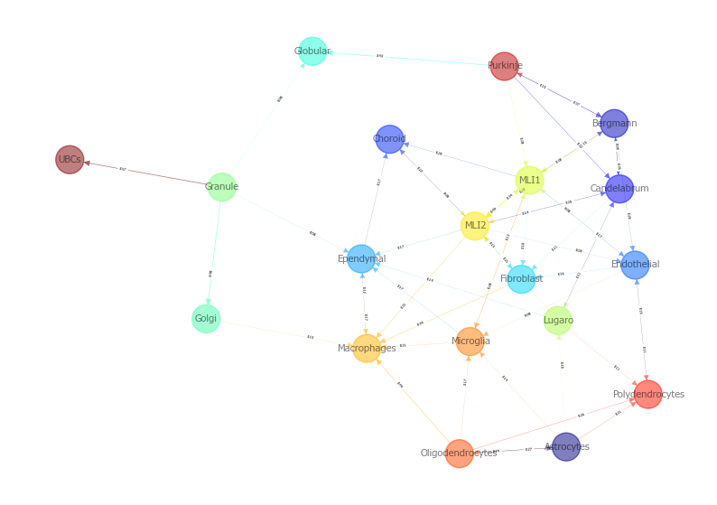
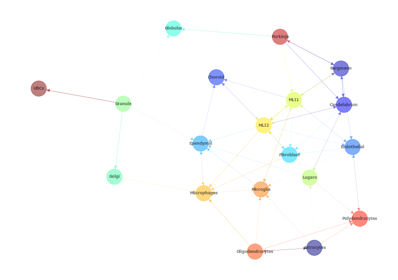

Tutorial 2: Slide-seqV2, Slide-tags, or Stereo-seq
==================================================

This tutorial guides through analysis of sequencing-based spatial transcriptomics data such as Slide-seqV2, Slide-tags, or Stereo-seq 
or any other similar technology.
This tutorial do not require scRNA-seq reference data for integration, and assumes that cells were already annotated by another method (e.g. RCTD).

.. code:: ipython3

    # if you installed the nico package 

    from nico import Annotations as sann
    from nico import Interactions as sint
    from nico import Covariations as scov

    import matplotlib as plt

    # if you did not install the nico package and downloaded the nico files into the current directory
    #import Annotations as sann
    #import Interactions as sint
    #import Covariations as scov

    #import scanpy as sc
    #import gseapy
    #import xlsxwriter

    #import numpy as np
    #import time
    #import os

    #import matplotlib as plt

.. code:: ipython3

    plt.rcParams['pdf.fonttype'] = 42
    plt.rcParams['ps.fonttype'] = 42
    plt.rcParams['axes.linewidth'] = 0.1 #set the value globally

    # please use Helvetica font according to your OS to ensure compatibility with Adobe Illustrator.
    #plt.rcParams['font.family'] = 'Helvetica'
    #plt.rcParams['font.sans-serif'] = ['Helvetica']

    # Use the default font for all the figures
    plt.rcParams['font.family'] = 'sans-serif'
    plt.rcParams['font.sans-serif'] = ['Tahoma', 'DejaVu Sans','Lucida Grande', 'Verdana']

    import warnings
    warnings.filterwarnings("ignore")

Usage introduction
~~~~~~~~~~~~~~~~~~

For details of the function usage and input parameters either refer to
the documentation or just write the function and add .doc to
retrieve infromation on all relelvant parameters.

print(sann.find_anchor_cells_between_ref_and_query.doc)
print(sint.spatial_neighborhood_analysis.doc)
print(scov.gene_covariation_analysis.doc)

All the figures will be saved in ``saveas=pdf`` format as vector
graphics by default. For every function that generates figures, the
following default parameters are used: transparent_mode=False,
saveas=‘pdf’,showit=True, dpi=300.

For saving figures in png format, set saveas=‘png’ For generating images
without background, set transparent_mode=True. If figure outputs within
the Jupyter Notebook are not desired, set showit=False.

Please download the sample data from the git repository
https://github.com/ankitbioinfo/nico_tutorial and keep all the files and
folders in the same directory to complete the tutorial.

NiCoLRdb.txt (Ligand-receptor database file)

Download the data from https://www.dropbox.com/scl/fi/6hxyp2pxpxalw9rfirby6/nico\_cerebellum.zip?rlkey=9ye6rsk92uj9648ogjw5ypcum\&st=lvc8e366\&dl=0
and place the data in the following path to complete the tutorial: `nico_cerebellum/cerebellum.h5ad`
 
annotation_save_fname= ‘cerebellum.h5ad’ is the low resolution
sequencing-based spatial transcriptomics file. In this anndata object, the .X
slot contains the normalized expression matrix and the .raw.X slot contains the
count matrix.

.. code:: ipython3

    # parameters for saving plots

    saveas='png'
    transparent_mode=False

.. code:: ipython3

    output_nico_dir='./nico_cerebellum/'
    output_annotation_dir=output_nico_dir+'annotations/'
    sann.create_directory(output_annotation_dir)

    annotation_save_fname= 'cerebellum.h5ad'
    #In this anndata .X slot contains the normalize matrix
    # and in the .raw.X slot contains the count matrix

.. code:: ipython3

    # parameters of the nico
    inputRadius=0
    annotation_slot='rctd_first_type' #spatial cell type slot

A: Visualize cell type annotation of spatial data
-------------------------------------------------

.. code:: ipython3

    sann.visualize_umap_and_cell_coordinates_with_all_celltypes(
    output_nico_dir=output_nico_dir,
    output_annotation_dir=output_annotation_dir,
    anndata_object_name=annotation_save_fname,
    spatial_cluster_tag=annotation_slot,
    spatial_coordinate_tag='spatial',
    umap_tag='X_umap',
    saveas=saveas,transparent_mode=transparent_mode)

.. parsed-literal::

    The figures are saved:  ./nico_cerebellum/annotations/tissue_and_umap_with_all_celltype_annotations.png

Visualize spatial annotations of selected pairs (or larger sets) of cell types
~~~~~~~~~~~~~~~~~~~~~~~~~~~~~~~~~~~~~~~~~~~~~~~~~~~~~~~~~~~~~~~~~~~~~~~~~~~~~~

Left side: tissue map, Right side: UMAP

.. code:: ipython3

    choose_celltypes=[['Purkinje','Bergmann']]

    # For visualizing every cell type individually, leave list choose_celltypes empty.
    sann.visualize_umap_and_cell_coordinates_with_selected_celltypes(
    output_nico_dir=output_nico_dir,
    output_annotation_dir=output_annotation_dir,
    anndata_object_name=annotation_save_fname,
    spatial_cluster_tag=annotation_slot,
    spatial_coordinate_tag='spatial',
    umap_tag='X_umap',
    choose_celltypes=choose_celltypes,
    saveas=saveas,transparent_mode=transparent_mode)

.. parsed-literal::

    The figures are saved:  ./nico_cerebellum/annotations/fig_individual_annotation/Purkinje0.png

B: Infer significant niche cell type interactions
-------------------------------------------------

**Radius definition**

If the radius in NiCo is set to R=0, NiCo incorporates the neighboring cells 
that are in immediate contact with the central cell to construct the expected
neighborhood composition matrix. We envision NiCo as a method to explore
direct interactions with physical neighbors (R=0), but in principle
finite distance interactions mediated by diffusive factors could be
explored by increasing R and comparing to the interactions obtained with
R=0.

It may be helpful to explore a larger radius if it is expected that cell
types interact through long-range interactions. However, during the
covariation task, immediate neighbors typically capture the strongest
signal, while a larger radius averages the signal from a bigger number of cells, 
potentially diluting the signal. Therefore, we recommend running NiCo with R=0.

Perform neighborhood analysis across direct neighbors (juxtacrine
signaling, R=0) of the central niche cell type by setting inputRadius=0.

To exclude cell types from the neighborhood analysis, add celltype names
to the list removed_CTs_before_finding_CT_CT_interactions. In the
example below, the cell types ``nan``, would not be included.

.. code:: ipython3

    do_not_use_following_CT_in_niche=['nan']

    niche_pred_output=sint.spatial_neighborhood_analysis(
    Radius=inputRadius,
    output_nico_dir=output_nico_dir,
    anndata_object_name=annotation_save_fname,
    spatial_cluster_tag=annotation_slot,
    removed_CTs_before_finding_CT_CT_interactions=do_not_use_following_CT_in_niche)

.. parsed-literal::

    average neighbors: 5.8214227309893705
    average distance: 30.979645956596595
    data shape (30569, 21) (30569,) neighbor shape (30569, 19)
    Searching hyperparameters  Grid method: 0.000244140625
    Searching hyperparameters  Grid method: 0.000244140625
    Inverse of lambda regularization found 0.000244140625
    training (24456, 19) testing (6113, 19) coeff (19, 19)

.. code:: ipython3

    # this cutoff is use for the visualization of cell type interactions network
    celltype_niche_interaction_cutoff=0.08

In some computing environments pygraphviz is not able to load the neato
package automatically. In such cases, please define the location of the
neato package. If you install pygraphviz through conda
``conda install -c conda-forge pygraphviz`` then most likely it should
work.

::

   import pygraphviz
   a=pygraphviz.AGraph()
   a._get_prog('neato')

   import os
   if  not '/home/[username]/miniforge3/envs/SC/bin/' in os.environ["PATH"]:
       os.environ["PATH"] += os.pathsep + '/home/[username]/miniforge3/envs/SC/bin/'

.. code:: ipython3

    # Plot the niche interaction network with edge weight details for cutoff 0.08
    sint.plot_niche_interactions_with_edge_weight(niche_pred_output,niche_cutoff=celltype_niche_interaction_cutoff,saveas=saveas,transparent_mode=transparent_mode)

.. parsed-literal::

    The figures are saved:  ./nico_cerebellum/niche_prediction_linear/Niche_interactions_with_edge_weights_R0.png

.. code:: ipython3

    # Plot the niche interaction network without any edge weight details for cutoff 0.08

    sint.plot_niche_interactions_without_edge_weight(niche_pred_output,niche_cutoff=celltype_niche_interaction_cutoff,saveas=saveas,transparent_mode=transparent_mode)

.. parsed-literal::

    The figures are saved:  ./nico_cerebellum/niche_prediction_linear/Niche_interactions_without_edge_weights_R0.png

Individual cell type niche plot
-------------------------------

To plot regression coefficients of niche cell types for given central cell types, ordered by magnitude,
add cell type names for the desired central cell types to the list argument choose_celltypes (e.g. Purkinje 
and Bergmann cells).

.. code:: ipython3

    # Blue dotted line in following plot is celltype_niche_interaction_cutoff

    sint.find_interacting_cell_types(niche_pred_output,choose_celltypes=['Purkinje','Bergmann'],
    celltype_niche_interaction_cutoff=celltype_niche_interaction_cutoff,
    saveas=saveas,transparent_mode=transparent_mode,figsize=(4.0,2.0))

.. parsed-literal::

    The figures are saved:  ./nico_cerebellum/niche_prediction_linear/TopCoeff_R0/Rank2_Purkinje.png
    The figures are saved:  ./nico_cerebellum/niche_prediction_linear/TopCoeff_R0/Rank6_Bergmann.png

If niche cell types from the niche neighborhood of all central cell
types should be plotted or saved, then leave the choose_celltypes list
argument empty.

.. code:: ipython3

    #sint.find_interacting_cell_types(niche_pred_output,choose_celltypes=[])

.. code:: ipython3

    # Plot the ROC curve of the classifier prediction for one of the cross-folds.
    # sint.plot_roc_results(niche_pred_output,saveas=saveas,transparent_mode=transparent_mode)

Plot the average confusion matrix of the classifier from cross-folds:

.. code:: ipython3

    sint.plot_confusion_matrix(niche_pred_output,
    saveas=saveas,transparent_mode=transparent_mode)

.. parsed-literal::

    The figures are saved:  ./nico_cerebellum/niche_prediction_linear/Confusing_matrix_R0.png

.. image:: tutorial2_files/tutorial2_27_1.png

Plot the average coefficient matrix of the classifier from cross-folds:

.. code:: ipython3

    sint.plot_coefficient_matrix(niche_pred_output,
    saveas=saveas,transparent_mode=transparent_mode)

.. parsed-literal::

    The figures are saved:  ./nico_cerebellum/niche_prediction_linear/weight_matrix_R0.png

.. code:: ipython3

    #st.plot_predicted_probabilities(niche_pred_output)

Plot the evaluation score of the classifier for different metrics:

.. code:: ipython3

    sint.plot_evaluation_scores(niche_pred_output,
    saveas=saveas, transparent_mode=transparent_mode, figsize=(4,3))

.. parsed-literal::

    The figures are saved:  ./nico_cerebellum/niche_prediction_linear/scores_0.png

C: Perform niche cell state covariation analysis using latent factors
---------------------------------------------------------------------

Note: From module C onwards, Jupyter cells are independent of previous
steps. Therefore, if you want to try different settings, you do not need
to run the previous Jupyter cells.

Covariation parameter settings
~~~~~~~~~~~~~~~~~~~~~~~~~~~~~~~~

Infer desired number of latent factors (e.g., no_of_factors=3) for each
cell type. Here, we consider only the spatial modality and thus use conventional
non-negative matrix factorization.

Set spatial_integration_modality=‘single’ for applying the conventional
non-negative matrix factorization method on unimodal spatial data
without integration.

In this case, latent factors will be derived from the spatial data
alone.

Ligand-Receptor database file
~~~~~~~~~~~~~~~~~~~~~~~~~~~~~

NiCoLRdb.txt is the name of the ligand-receptor database file. Users can
use databases of similar format from any resource.

NiCoLRdb.txt was created by merging ligand-receptor pairs from NATMI,
OMNIPATH, and CellPhoneDB. It can be downloaded from github
and saved in the local directory from where this notebook is run.

.. code:: ipython3

    # By default, the function is run with spatial_integration_modality='double', i.e. 
    # it integrates spatial transcriptomics with scRNAseq data
    # For running it only on spatial transcriptomics data, specify 
    # spatial_integration_modality='single'

    cov_out=scov.gene_covariation_analysis(Radius=inputRadius,
    no_of_factors=3,
    spatial_integration_modality='single',
    anndata_object_name=annotation_save_fname,
    output_niche_prediction_dir=output_nico_dir,
    ref_cluster_tag=annotation_slot) #LRdbFilename='NiCoLRdb.txt'

.. parsed-literal::

    common genes between sc and sp 5160 5160

     Spatial and scRNA-seq number of clusters, respectively  19 19
    Common cell types between spatial and scRNA-seq data   19 {'Lugaro', 'Ependymal', 'Candelabrum', 'Bergmann', 'Purkinje', 'Golgi', 'Fibroblast', 'Macrophages', 'MLI2', 'MLI1', 'Oligodendrocytes', 'Polydendrocytes', 'Endothelial', 'Granule', 'Microglia', 'Choroid', 'Globular', 'Astrocytes', 'UBCs'}

    The spatial cluster name does not match the scRNA-seq cluster name  set()
    If the above answer is Null, then everything is okay. However, if any spatial cell type does not exist in the scRNA-seq data, please correct this manually; otherwise, NiCo will not run.

    Astrocytes alpha, H size, W size, spH size: 0 (3, 897) (4676, 3) (3, 897)
    Bergmann alpha, H size, W size, spH size: 0 (3, 1534) (4802, 3) (3, 1534)
    Candelabrum alpha, H size, W size, spH size: 0 (3, 42) (2823, 3) (3, 42)
    Choroid alpha, H size, W size, spH size: 0 (3, 33) (2079, 3) (3, 33)
    Endothelial alpha, H size, W size, spH size: 0 (3, 96) (2965, 3) (3, 96)
    Ependymal alpha, H size, W size, spH size: 0 (3, 54) (2767, 3) (3, 54)
    Fibroblast alpha, H size, W size, spH size: 0 (3, 307) (4206, 3) (3, 307)
    Globular alpha, H size, W size, spH size: 0 (3, 15) (2104, 3) (3, 15)
    Golgi alpha, H size, W size, spH size: 0 (3, 221) (4224, 3) (3, 221)
    Granule alpha, H size, W size, spH size: 0 (3, 20575) (5147, 3) (3, 20575)
    Lugaro alpha, H size, W size, spH size: 0 (3, 78) (3715, 3) (3, 78)
    MLI1 alpha, H size, W size, spH size: 0 (3, 888) (4478, 3) (3, 888)
    MLI2 alpha, H size, W size, spH size: 0 (3, 888) (4378, 3) (3, 888)
    Macrophages alpha, H size, W size, spH size: 0 (3, 10) (642, 3) (3, 10)
    Microglia alpha, H size, W size, spH size: 0 (3, 69) (2540, 3) (3, 69)
    Oligodendrocytes alpha, H size, W size, spH size: 0 (3, 2087) (4797, 3) (3, 2087)
    Polydendrocytes alpha, H size, W size, spH size: 0 (3, 113) (3538, 3) (3, 113)
    Purkinje alpha, H size, W size, spH size: 0 (3, 2583) (4931, 3) (3, 2583)
    UBCs alpha, H size, W size, spH size: 0 (3, 85) (3415, 3) (3, 85)

Visualize the cosine similarity and Spearman correlation between genes and latent factors
~~~~~~~~~~~~~~~~~~~~~~~~~~~~~~~~~~~~~~~~~~~~~~~~~~~~~~~~~~~~~~~~~~~~~~~~~~~~~~~~~~~~~~~~~

The following function generates output for the top 30 genes based on cosine
similarity (left) or Spearman correlation (right) with latent factors.

Select cell types by adding IDs to the list argument choose_celltypes, or
leave empty for generating output for all cell types.

.. code:: ipython3

    scov.plot_cosine_and_spearman_correlation_to_factors(cov_out,
    choose_celltypes=['Bergmann'],
    NOG_Fa=30,
    saveas=saveas,transparent_mode=transparent_mode,
    figsize=(15,10))

.. parsed-literal::

    cell types found  ['Bergmann']
    The figures are saved:  ./nico_cerebellum/covariations_R0_F3/NMF_output/Bergmann.png

Visualizes genes associated with the latent factors along with average expression
~~~~~~~~~~~~~~~~~~~~~~~~~~~~~~~~~~~~~~~~~~~~~~~~~~~~~~~~~~~~~~~~~~~~~~~~~~~~~~~~~

Call the following function
(scov.extract_and_plot_top_genes_from_chosen_factor_in_celltype) to
visualize correlation and expression of genes associated with factors

For example, visualize and extract the top 20 genes (top_NOG=20)
correlating negatively (positively_correlated=False) by Spearman
correlation (correlation_with_spearman=True) for cell type Purkinje
(choose_celltype=‘Purkinje’) to factor 1 (choose_factor_id=1)

.. code:: ipython3

    dataFrame=scov.extract_and_plot_top_genes_from_chosen_factor_in_celltype(cov_out,
    choose_celltype='Purkinje',
    choose_factor_id=1,
    top_NOG=20,correlation_with_spearman=True,positively_correlated=True,
    saveas=saveas,transparent_mode=transparent_mode )

.. parsed-literal::

    The figures are saved:  ./nico_cerebellum/covariations_R0_F3/dotplots/Factors_Purkinje.png

Inspect genes associated with a latent factor
~~~~~~~~~~~~~~~~~~~~~~~~~~~~~~~~~~~~~~~~~~~~~

Inspect the top genes associated with a the given factor. The table summarizes the 
positive or negative spearman correlation or cosine similarity with the factor, the mean
expression and the proportion of cells expressing the gene for the respective cell type.

.. code:: ipython3

    dataFrame

.. raw:: html

    

    
    <table border="1" class="dataframe">
      <thead>
        <tr style="text-align: right;">
          <th></th>
          <th>Gene</th>
          <th>Fa</th>
          <th>mean_expression</th>
          <th>proportion_of_population_expressed</th>
        </tr>
      </thead>
      <tbody>
        <tr>
          <th>0</th>
          <td>Calb1</td>
          <td>0.758210</td>
          <td>4.204801</td>
          <td>0.844367</td>
        </tr>
        <tr>
          <th>1</th>
          <td>Pcp4</td>
          <td>0.757111</td>
          <td>6.616725</td>
          <td>0.932249</td>
        </tr>
        <tr>
          <th>2</th>
          <td>Car8</td>
          <td>0.756901</td>
          <td>6.302749</td>
          <td>0.934959</td>
        </tr>
        <tr>
          <th>3</th>
          <td>Atp1b1</td>
          <td>0.752535</td>
          <td>3.228417</td>
          <td>0.773906</td>
        </tr>
        <tr>
          <th>4</th>
          <td>Nsg1</td>
          <td>0.735999</td>
          <td>3.327526</td>
          <td>0.803329</td>
        </tr>
        <tr>
          <th>5</th>
          <td>Itm2b</td>
          <td>0.735834</td>
          <td>3.303136</td>
          <td>0.802555</td>
        </tr>
        <tr>
          <th>6</th>
          <td>Calm2</td>
          <td>0.702097</td>
          <td>2.882307</td>
          <td>0.795587</td>
        </tr>
        <tr>
          <th>7</th>
          <td>Atp2a2</td>
          <td>0.681419</td>
          <td>2.284940</td>
          <td>0.708866</td>
        </tr>
        <tr>
          <th>8</th>
          <td>Dner</td>
          <td>0.670894</td>
          <td>2.528068</td>
          <td>0.749129</td>
        </tr>
        <tr>
          <th>9</th>
          <td>Pvalb</td>
          <td>0.661823</td>
          <td>3.056523</td>
          <td>0.839334</td>
        </tr>
        <tr>
          <th>10</th>
          <td>Ckb</td>
          <td>0.633108</td>
          <td>3.635308</td>
          <td>0.862176</td>
        </tr>
        <tr>
          <th>11</th>
          <td>Calm1</td>
          <td>0.627708</td>
          <td>2.569880</td>
          <td>0.794812</td>
        </tr>
        <tr>
          <th>12</th>
          <td>Itpr1</td>
          <td>0.609601</td>
          <td>4.615563</td>
          <td>0.900503</td>
        </tr>
        <tr>
          <th>13</th>
          <td>Ndrg4</td>
          <td>0.603611</td>
          <td>1.571816</td>
          <td>0.638405</td>
        </tr>
        <tr>
          <th>14</th>
          <td>Pcp2</td>
          <td>0.599627</td>
          <td>3.116144</td>
          <td>0.874952</td>
        </tr>
        <tr>
          <th>15</th>
          <td>Ppp1r17</td>
          <td>0.595415</td>
          <td>1.731707</td>
          <td>0.671700</td>
        </tr>
        <tr>
          <th>16</th>
          <td>Ywhah</td>
          <td>0.592602</td>
          <td>1.284940</td>
          <td>0.593496</td>
        </tr>
        <tr>
          <th>17</th>
          <td>Stmn3</td>
          <td>0.575030</td>
          <td>1.546264</td>
          <td>0.654278</td>
        </tr>
        <tr>
          <th>18</th>
          <td>Nptn</td>
          <td>0.555403</td>
          <td>1.041038</td>
          <td>0.530004</td>
        </tr>
        <tr>
          <th>19</th>
          <td>Mdh1</td>
          <td>0.552998</td>
          <td>1.429733</td>
          <td>0.627178</td>
        </tr>
      </tbody>
    </table>
    

Save the latent factors into an excel sheet
~~~~~~~~~~~~~~~~~~~~~~~~~~~~~~~~~~~~~~~~~~~~~

Save data in an excel sheet for each cell type, including latent factor
associations of all genes according to Spearman correlation and cosine
similarity.

.. code:: ipython3

    scov.make_excel_sheet_for_gene_correlation(cov_out)

D: Cell type covariation visualization
--------------------------------------

Plot linear regression coefficients between factors of the central cell type (y-axis, 
defined by list argument choose_celltypes) and factors of niche cell types (x-axis).

Circle size scales with -log10(p-value) (indicated as number on top of
each circle). To generate plots for all cell types, leave list argument
choose_celltypes empty.

.. code:: ipython3

    scov.plot_significant_regression_covariations_as_circleplot(cov_out,
    choose_celltypes=['Bergmann'],
    pvalue_cutoff=0.05,mention_pvalue=True,
    saveas=saveas,transparent_mode=transparent_mode,
    figsize=(6,1.25))

    # In the following example, a p-value cutoff is explicitely defined by the pvalue_cutoff argument.
    # p-value is printed as the -log10(p-value) on top of circle.
    # circle color is the regression coefficients

.. parsed-literal::

    cell types found  ['Bergmann']
    The regression figures as pvalue circle plots are saved in following path  ./nico_cerebellum/covariations_R0_F3/Regression_outputs/pvalue_coeff_circleplot_*

Visualize as heatmap instead of circle plot
~~~~~~~~~~~~~~~~~~~~~~~~~~~~~~~~~~~~~~~~~~~

Plot regression coefficients between niche cell types (x-axis) and central cell
type (y-axis, defined by list argument choose_celltypes) as heatmap.

Leave list argument choose_celltypes empty to generate plots for all
cell types. The top subfigure shows the coefficients and bottom subfigure
shows the -log10 p-values.

.. code:: ipython3

    scov.plot_significant_regression_covariations_as_heatmap(cov_out,
    choose_celltypes=['Bergmann'],
    saveas=saveas,transparent_mode=transparent_mode, figsize=(6,1.25))

.. parsed-literal::

    cell types found  ['Bergmann']
    The regression figures as pvalue heatmap plots are saved in following path  ./nico_cerebellum/covariations_R0_F3/Regression_outputs/pvalue_coeff_heatmap_*

E: Analysis of ligand-receptor interactions between covarying niche cell types
------------------------------------------------------------------------------

Save excel sheets and summary in text file
~~~~~~~~~~~~~~~~~~~~~~~~~~~~~~~~~~~~~~~~~~

Save all ligand-receptor interactions infered for the niche of each cell
type in an excel sheet, and a summary of significant niche
interactions in a text file.

.. code:: ipython3

    scov.save_LR_interactions_in_excelsheet_and_regression_summary_in_textfile_for_interacting_cell_types(cov_out,
    pvalueCutoff=0.05,correlation_with_spearman=True,
    LR_plot_NMF_Fa_thres=0.1,LR_plot_Exp_thres=0.1,number_of_top_genes_to_print=5)

.. parsed-literal::

    The Excel sheet is saved:  ./nico_cerebellum/covariations_R0_F3/Lig_and_Rec_enrichment_in_interacting_celltypes.xlsx
    The text file is saved: ./nico_cerebellum/covariations_R0_F3/Regression_summary.txt

Usage for ligand-receptor visualizations
~~~~~~~~~~~~~~~~~~~~~~~~~~~~~~~~~~~~~~~~

Perform ligand-receptors analysis In this example, output is generated
for the ligand-receptor pairs associated with the intercting factor 1 of
Bergmann cells and factor 1 of Purkinje cells.

choose_interacting_celltype_pair=[‘Bergmann’,‘Purkinje’]

choose_factors_id=[1,1] entries correspond to cell types in
choose_interacting_celltype_pair, i.e., first factor ID corresponds to
Bergmann and second factor ID corresponds to Purkinje.

By default, the analysis is saved in 3 separate figures (bidirectional,
CC to NC and NC to CC). CC: central cell NC: niche cell

Our analysis accounts for bidirectional cellular crosstalk interactions
of ligands and receptors in cell types A and B. The ligand can be
expressed on cell type A and signal to the receptor detected on cell
type B, or vice versa.

By changing the cutoff for minimum factor correlation of ligand/receptor
genes (LR_plot_NMF_Fa_thres=0.2) or the cutoff for the minimum fraction
of cells expressing the ligand/receptor genes (LR_plot_Exp_thres=0.2)
the stringency of the output filtering can be controled.

.. code:: ipython3

    scov.find_LR_interactions_in_interacting_cell_types(cov_out,
    choose_interacting_celltype_pair=['Bergmann','Purkinje'],
    choose_factors_id=[1,1],
    pvalueCutoff=0.05,
    LR_plot_NMF_Fa_thres=0.15,
    LR_plot_Exp_thres=0.15,
    saveas=saveas,transparent_mode=transparent_mode,figsize=(12, 10))

.. parsed-literal::

    LR figures for both ways are saved in following path  ./nico_cerebellum/covariations_R0_F3/Plot_ligand_receptor_in_niche/
    LR figures for CC to NC are saved in following path  ./nico_cerebellum/covariations_R0_F3/Plot_ligand_receptor_in_niche_cc_vs_nc/
    LR figures for NC to CC are saved in following path  ./nico_cerebellum/covariations_R0_F3/Plot_ligand_receptor_in_niche_nc_vs_cc/

.. parsed-literal::

    0

Perform ligand-receptors analysis of the Bergmann cell niche including
all significant interaction partners.

choose_interacting_celltype_pair=[‘Bergmann’] generates plots for all
cell types interacting sigificantly with Bergmann cells.

choose_factors_id=[] if empty, generates plots for all significantly
covarying factors

.. code:: ipython3

    # scov.find_LR_interactions_in_interacting_cell_types(all_output_data,choose_interacting_celltype_pair=['Bergmann'],
    #   choose_factors_id=[], LR_plot_NMF_Fa_thres=0.2,LR_plot_Exp_thres=0.2,saveas=saveas,transparent_mode=transparent_mode)

F: Perform functional enrichment analysis for genes associated with latent factors
----------------------------------------------------------------------------------

Perform pathway enrichment analysis for factor-associated genes
~~~~~~~~~~~~~~~~~~~~~~~~~~~~~~~~~~~~~~~~~~~~~~~~~~~~~~~~~~~~~~~

In this example, pathway analysis is performed for the top 50
(NOG_pathway=50) genes, positively correlated
(positively_correlated=True) with factor 1 (choose_factors_id=[1]) of
Bergmann cells (choose_celltypes=[‘Bergmann’]) testing for enrichment of
Bioplanet 2019 (database=[‘BioPlanet_2019’]).

If savefigure=True, then the figures will be saved in the respective
folder.

.. code:: ipython3

    scov.pathway_analysis(cov_out,
    choose_celltypes=['Bergmann'],
    NOG_pathway=50,
    choose_factors_id=[1],
    positively_correlated=True,
    savefigure=False,database=['BioPlanet_2019'])

.. parsed-literal::

    The pathway figures are saved in  ./nico_cerebellum/covariations_R0_F3/Pathway_figures/
    cell types found  ['Bergmann']

In this example, pathway analysis is performed for the top 50
(NOG_pathway=50) genes, postively correlated
(positively_correlated=True) with factor 1 (choose_factors_id=[1]) of
Purkinje cells (choose_celltypes=[‘Purkinje']) testing for enrichment of
GO Biological Processes (database=[‘BioPlanet_2019’]).

If savefigure=True, then the figures will be saved in the respective
folder.

.. code:: ipython3

    scov.pathway_analysis(cov_out,
    choose_celltypes=['Purkinje'],
    NOG_pathway=50,
    choose_factors_id=[1],
    positively_correlated=True,
    savefigure=False,database=['BioPlanet_2019'])

.. parsed-literal::

    The pathway figures are saved in  ./nico_cerebellum/covariations_R0_F3/Pathway_figures/
    cell types found  ['Purkinje']

.. image:: tutorial2_files/tutorial2_70_1.png

G: Visualization of top genes across cell types and factors as dotplot
---------------------------------------------------------------------

Show the top 20 positively and negatively correlated genes (top_NOG=20) to 
the factors in visualize_factors_id and their average expression on a log scale for 
corresponding cell types indicated in choose_interacting_celltype_pair. 
In this example, plots are generated for factor 1 for Purkinje cells and factor 1
for Bergmann cells.

If the choose_celltypes=[], the plot will be generated for all cell types. 

.. code:: ipython3

    scov.plot_top_genes_for_pair_of_celltypes_from_two_chosen_factors(cov_out,
    choose_interacting_celltype_pair=['Purkinje','Bergmann'],
    visualize_factors_id=[1,1],
    top_NOG=20,saveas=saveas,transparent_mode=transparent_mode)

.. parsed-literal::

    The figures are saved:  ./nico_cerebellum/covariations_R0_F3/dotplots/combined_Purkinje_Bergmann.png

.. code:: ipython3

    scov.plot_top_genes_for_a_given_celltype_from_all_three_factors(cov_out,
    choose_celltypes=['Bergmann','Purkinje'],
    top_NOG=20,saveas=saveas,transparent_mode=transparent_mode)

.. parsed-literal::

    cell types found  ['Bergmann', 'Purkinje']
    The figures are saved:  ./nico_cerebellum/covariations_R0_F3/dotplots/Bergmann.png
    The figures are saved:  ./nico_cerebellum/covariations_R0_F3/dotplots/Purkinje.png

.. image:: tutorial2_files/tutorial2_75_1.png

H: Visualize factor values in the UMAP
---------------------------------------

Visualize factor values for select cell types, e.g., Bergmann and Purkinje
cells (choose_interacting_celltype_pair=[['Bergmann','Purkinje']) in
scRNA-seq data umap. Select factors for each cell type
(visualize_factors_id=[1,1]).

.. code:: ipython3

    scov.visualize_factors_in_spatial_umap(cov_out,
    visualize_factors_id=[1,1],
    umap_tag='X_umap',
    choose_interacting_celltype_pair=['Bergmann','Purkinje'],
    saveas=saveas,transparent_mode=transparent_mode,figsize=(8,3.5))

.. parsed-literal::

    The figures are saved:  ./nico_cerebellum/covariations_R0_F3/spatial_factors_in_umap.png

.. parsed-literal::

    0

.. code:: ipython3

    scov.visualize_factors_in_spatial_umap(cov_out,
    visualize_factors_id=[1],
    umap_tag='X_umap',
    choose_interacting_celltype_pair=['Bergmann'],
    saveas=saveas,transparent_mode=transparent_mode,figsize=(4,3.5))

.. parsed-literal::

    The figures are saved:  ./nico_cerebellum/covariations_R0_F3/spatial_factors_in_umap.png

.. parsed-literal::

    0

